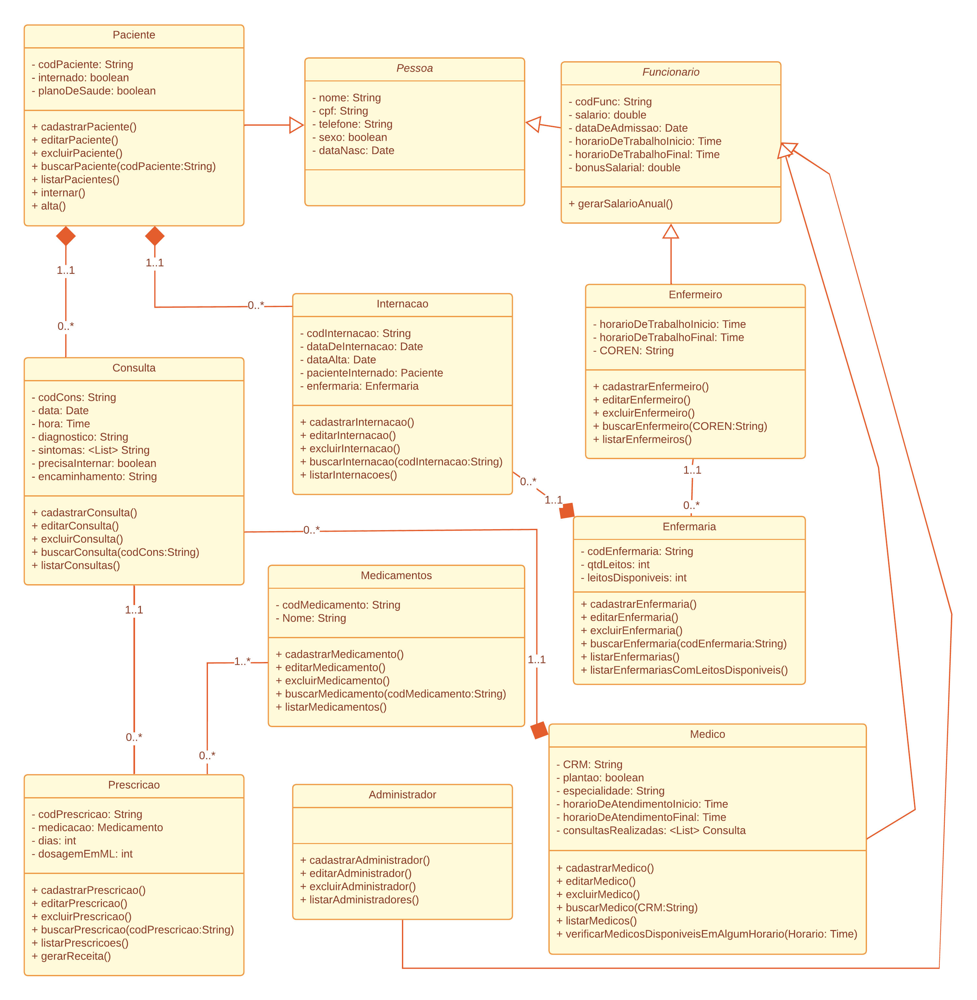

## Hospital Management System

Este é um sistema de gerenciamento de hospital desenvolvido em Java.

## Topicos
- [Hospital Management System](#hospital-management-system)
- [Topicos](#topicos)
- [Descrição](#descrição)
- [Funcionalidades](#funcionalidades)
- [Diagrama de classes](#diagrama-de-classes)
- [Requisitos](#requisitos)
- [Instalação](#instalação)
- [Licença](#licença)

## Descrição

O Hospital Management System é um projeto que visa facilitar o gerenciamento de um hospital, permitindo o cadastro de pacientes, médicos, enfermeiros e outros profissionais de saúde, além de possibilitar o agendamento de consultas e a geração de relatórios.

## Funcionalidades

- Cadastro de pacientes, médicos, enfermeiros
- Agendamento de consultas
- Internacoes
- Gerenciamento de leitos
- Prescricao de medicamentos
- Geração de relatórios

## Diagrama de classes

## Requisitos

- Java 8 ou superior
- Banco de dados SQLlite

## Instalação

1. Clone o repositório: `git clone (URL do repositorio)`
2. Importe o projeto em sua IDE preferida
3. Execute o arquivo `Main.java` para iniciar o sistema

## Licença

Este projeto está licenciado sob a [MIT License](LICENSE).

